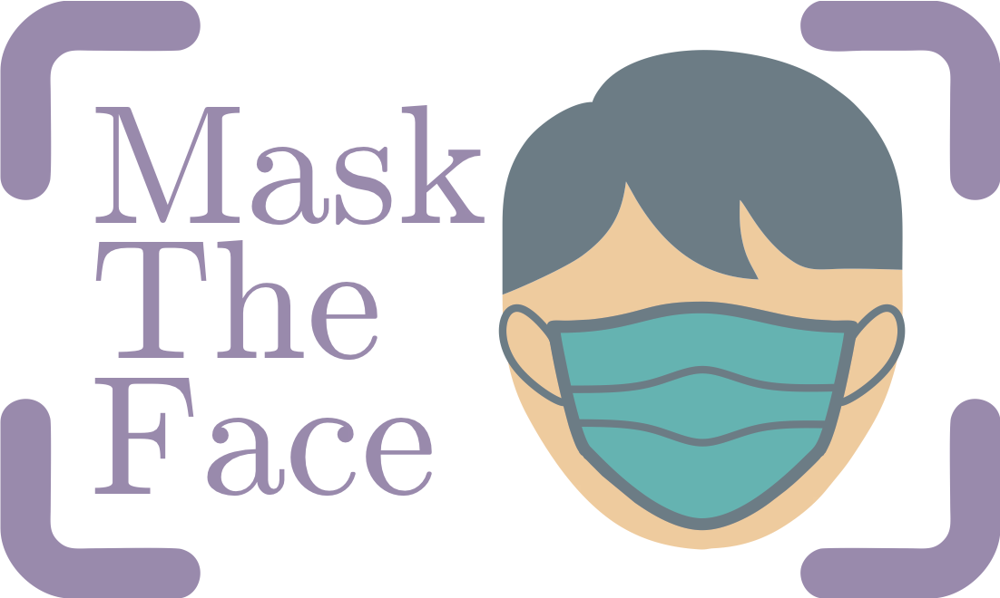
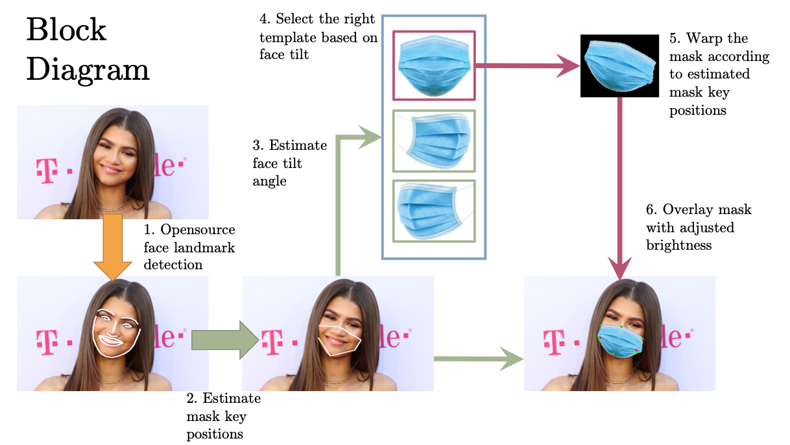
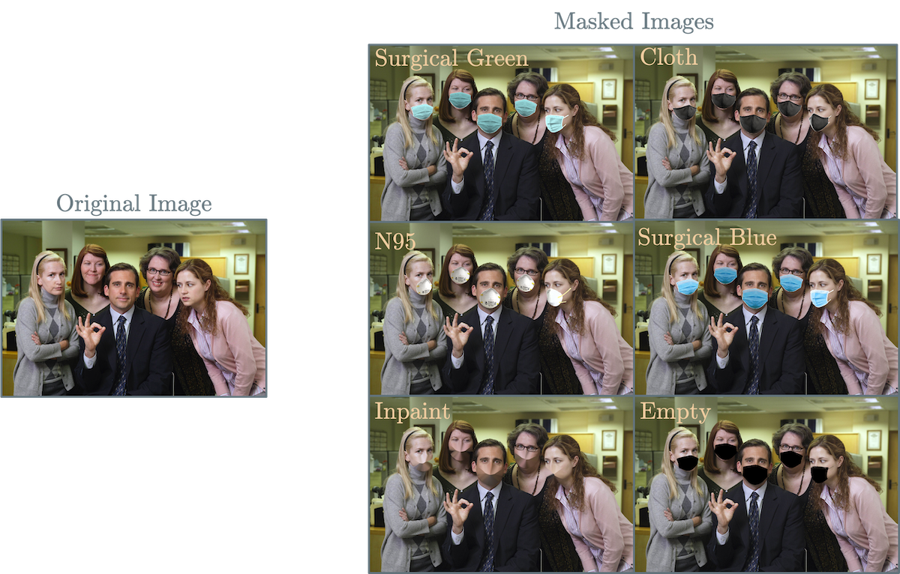
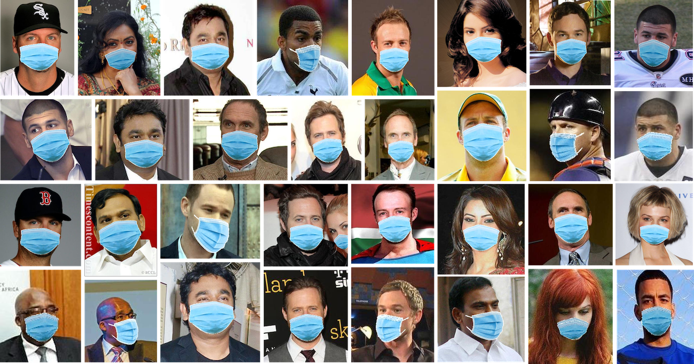
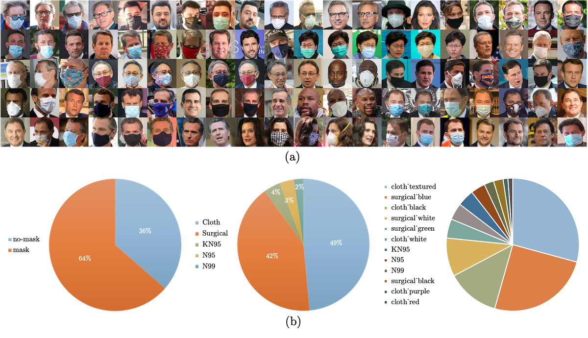

# MaskTheFace - Convert face dataset to masked dataset

## What is MaskTheFace?
MaskTheFace is computer vision-based script to mask faces in images. It uses a dlib based face landmarks detector to identify the face tilt and six key features of the face necessary for applying mask. Based on the face tilt, corresponding mask template is selected from the library of mask. The template mask is then transformed based on the six key features to fit perfectly on the face. The complete block diagram can be seen below. MaskTheFace provides a number of masks to select from. It is difficult to collect mask dataset under various conditions. MaskTheFace can be used to convert any existing face dataset to masked-face dataset. MaskTheFace identifies all the faces within an image, and applies the user selected masks to them taking into account various limitations such as face angle, mask fit, lighting conditions etc. A single image, or entire directory of images can be used as input to code.


## How to install MaskTheFace
It’s advisable to [make a new virtual environment](https://towardsdatascience.com/setting-up-python-platform-for-machine-learning-projects-cfd85682c54b) with Python 3.6 and install the dependencies. Following steps can be taken to download get started with MaskTheFace
### Clone the repository
```
git clone https://github.com/aqeelanwar/MaskTheFace.git
```

### Install required packages
The provided requirements.txt file can be used to install all the required packages. Use the following command

```
cd MaskTheFace
pip install –r requirements.txt
```

This will install the required packages in the activated Python environment.

## How to run MaskTheFace

```
cd MaskTheFace
# Generic
python mask_the_face.py --path <path-to-file-or-dir> --mask_type <type-of-mask> --verbose --write_original_image

# Example
python mask_the_face.py --path 'data/office.jpg' --mask_type 'N95' --verbose --write_original_image
```

### Arguments
|    Argument    |                                                                                                       Explanation                                                                                                       |
|:--------------:|:-----------------------------------------------------------------------------------------------------------------------------------------------------------------------------------------------------------------------:|
|      path      |                                                                            Path to the image file or a folder containing images to be masked                                                                            |
|    mask_type   | Select the mask to be applied. Available options are 'N95', 'surgical_blue', 'surgical_green', 'cloth', 'empty' and 'inpaint'. The details of these mask types can be seen in the image above. More masks will be added |
|     pattern    |                                 Selects the pattern to be applied to the mask-type selected above. The textures are available in the masks/textures folder. User can add more textures.                                 |
| pattern_weight |                                   Selects the intensity of the pattern to be applied on the mask. The value should be between 0 (no texture strength) to 1 (maximum texture strength)                                   |
|      color     |                                                         Selects the color to be applied to the mask-type selected above. The colors are provided as hex values.                                                         |
|  color_weight  |                                      Selects the intensity of the color to be applied on the mask. The value should be between 0 (no color strength) to 1 (maximum color strength)                                      |
|      code      |                                                              Can be used to create specific mask formats at random. More can be found in the section below.                                                             |
|     verbose    |                                                                          If set to True, will be used to display useful messages during masking                                                                         |
|write_original_image|                   If used, the original unmasked image will also be saved in the masked image folder along with processed masked image                                                                              |

### Explanation:
#### 1. _--code_
The --code argument can be used to apply different type of masks uniformly at random to the images in the dataset.
```
# Generic format
--code < masktype1 >-< color as hex or texture file path >, < masktype2 >-< color as hex or texture file path>, ...

# Example
--code cloth-masks/textures/check/check_4.jpg, cloth-#e54294, cloth-#ff0000, cloth, cloth-masks/textures/others/heart_1.png, cloth-masks/textures/fruits/pineapple.png, N95
```
The example above will apply 7 different masks, uniform at random, to the selected face dataset (via --path argument).
## Frequently Asked Questions (FAQ)
Click [here](faq.md) to troubleshoot errors faced while installing and running MaskTheFace

## Supported Masks:
### Mask Types:
Currently MaskTheFace supports the following 4 mask types
1. Surgical
2. N95
3. KN95
4. Cloth
5. Gas


New masks are being added. Users, can also add custom masks following the guidelines provided.

### Mask Variations:
Each of the mask types mentioned above can be varied in the following terms to create even more masks
#### 1. Textures/Patterns variations:
MaskTheFace provides 24 existing patterns that can be applied to mask types above to create more variations of the graph. Moreover, users can easily add custom patterns following the guidelines provided.

#### 2. Color variations:
MaskTheFace provided script to modify existing mask types in terms of colors to generate variations of existing graphs.

####  3. Intensity variations:
MaskTheFace provided script to modify existing mask types in terms of intensity to generate variations of existing graphs.


## Features:
### Support for multiple mask types

### Support for both single and multi-face images:

### Wide face angle coverage

### Brightness corrected mask application

### Bulk masking on datasets



---

# MFR2 - Masked Faces in Real-World for Face Recognition
Masked faces in real world for face recognition (MFR2) is a small dataset with 53 identities of celebrities and politicians with a total of 269 images that are collected from the internet. Each identity has on an average of 5 images. The dataset contains both masked and unmasked faces of the identities.
The dataset is processed in terms of face alignment and image dimensions. Each image has a dimension of (160x160x3). Sample images from the MFR2 data-set and the mask distribution can be seen below.



## Download MFR2
The dataset can be downloaded using the following command

```
cd MaskTheFace
python utils/fetch_dataset.py --dataset mfr2
```
This will download and extract the mfr2 dataset in the datasets folder.

```
# path to mfr2
MaskTheFace/datasets/mfr2
```

Alternatively, you can download mfr2.zip file from [here](https://drive.google.com/file/d/1ukk0n_srRqcsotK2MjlFPj7L0sXcR2fH/view?usp=sharing)

## Contents of MFR2
The downloaded dataset folder contains
1. Folders with images of identities
2. mfr2_labels.txt: A label text file with identity name, image number, and type of mask ground truth
3. pairs.txt: A text file containing 848 positive and negative pairs to be used for testing

---

# Example usage

## 1. Face recognition with masks
Face recognition trained to usual face images has proven to give good accuracy. In the recent ongoing outbreak of Covid19, people have been advised to use face masks. With the majority of people using face masks, the face recognition system fails to perform. Due to limited mask images, there is not enough masked data available to train a new system. MaskTheFace can be used to create masked data set from an unmasked dataset which is then used to either fine-tune an existing or train a new face recognition system.

### Example
The paper below uses MaskTheFace for the application of masked face recognition and reports an increase of ∼38% in the true positive rate for the Facenet system. They also test the accuracy of the re-trained system on the MFR2 dataset and report similar accuracy.
[https://arxiv.org/pdf/2008.11104.pdf](https://arxiv.org/pdf/2008.11104.pdf)


## 2. Monitoring if people are using masks
MaskTheFace generated datasets can be used to monitor if people are using face masks.

### Example
The detector above was trained on 2000 images (1000 mask, 1000 without mask) from the VGGface2 dataset. The masked images contained 4 different types of masks. A VGG16 network was trained on these images which achieved a 98.9% accuracy on the test dataset.


## 3. Classify masks
MaskTheFace generated dataset can be used to classify among masks using a deep network.

## Citation
If you find this repository useful, please use following citation
```
@misc{anwar2020masked,
title={Masked Face Recognition for Secure Authentication},
author={Aqeel Anwar and Arijit Raychowdhury},
year={2020},
eprint={2008.11104},
archivePrefix={arXiv},
primaryClass={cs.CV}
} 
```


## License
This project is licensed under the MIT License - see the [LICENSE.md](LICENSE) file for details
# MaskTheFace
